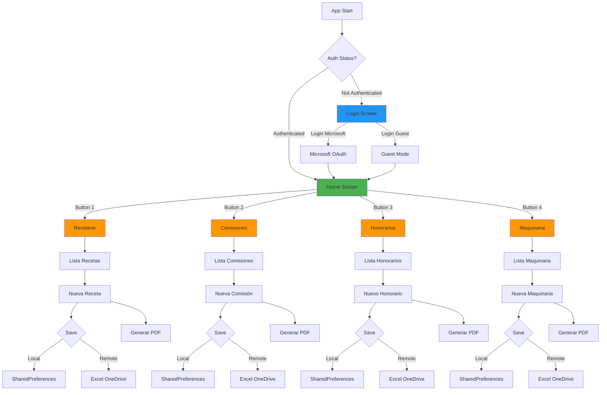
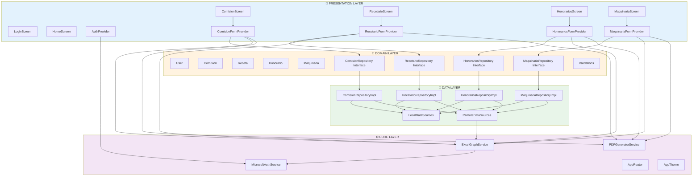

# 📊 Diagrama de Clases - Sistema Estribado

## 🎯 Diagrama de Clases Completo (Mermaid)

```mermaid
classDiagram
    %% ========================================
    %% CAPA DE PRESENTACIÓN (UI)
    %% ========================================
    
    class App {
        +main()
        +build()
    }
    
    class AppRouter {
        +GoRouter router
        +routes: List~RouteBase~
        +initialLocation: String
    }
    
    %% AUTH FEATURE
    class LoginScreen {
        +build(context)
        -onLoginWithMicrosoft()
        -onLoginAsGuest()
    }
    
    class AuthProvider {
        -MicrosoftAuthService authService
        +User? currentUser
        +bool isAuthenticated
        +bool isGuest
        +loginWithMicrosoft()
        +loginAsGuest()
        +logout()
        +checkAuthStatus()
    }
    
    %% HOME FEATURE
    class HomeScreen {
        +build(context)
        -navigateToRecetario()
        -navigateToComisiones()
        -navigateToHonorarios()
        -navigateToMaquinaria()
    }
    
    %% COMISIONES FEATURE
    class ComisionScreen {
        +build(context)
        -buildForm()
        -onSubmit()
        -onGeneratePDF()
        -onExportExcel()
    }
    
    class ComisionFormProvider {
        -ComisionRepository repository
        +Comision? currentComision
        +bool isLoading
        +String? errorMessage
        +createComision(data)
        +updateComision(id, data)
        +deleteComision(id)
        +loadComisiones()
        +generatePDF(comision)
        +exportToExcel(comisiones)
    }
    
    %% RECETARIO FEATURE
    class RecetarioScreen {
        +build(context)
        -buildForm()
        -onSubmit()
        -onGeneratePDF()
        -onExportExcel()
    }
    
    class RecetarioFormProvider {
        -RecetarioRepository repository
        +Receta? currentReceta
        +bool isLoading
        +String? errorMessage
        +createReceta(data)
        +updateReceta(id, data)
        +deleteReceta(id)
        +loadRecetas()
        +generatePDF(receta)
        +exportToExcel(recetas)
    }
    
    %% HONORARIOS FEATURE
    class HonorariosScreen {
        +build(context)
        -buildForm()
        -onSubmit()
        -onGeneratePDF()
        -onExportExcel()
    }
    
    class HonorariosFormProvider {
        -HonorariosRepository repository
        +Honorario? currentHonorario
        +bool isLoading
        +String? errorMessage
        +createHonorario(data)
        +updateHonorario(id, data)
        +deleteHonorario(id)
        +loadHonorarios()
        +generatePDF(honorario)
        +exportToExcel(honorarios)
    }
    
    %% MAQUINARIA FEATURE
    class MaquinariaScreen {
        +build(context)
        -buildForm()
        -onSubmit()
        -onGeneratePDF()
        -onExportExcel()
    }
    
    class MaquinariaFormProvider {
        -MaquinariaRepository repository
        +Maquinaria? currentMaquinaria
        +bool isLoading
        +String? errorMessage
        +createMaquinaria(data)
        +updateMaquinaria(id, data)
        +deleteMaquinaria(id)
        +loadMaquinarias()
        +generatePDF(maquinaria)
        +exportToExcel(maquinarias)
    }
    
    %% ========================================
    %% CAPA DE DOMINIO (Business Logic)
    %% ========================================
    
    %% AUTH DOMAIN
    class User {
        +String id
        +String name
        +String email
        +String? photoUrl
        +bool isGuest
        +DateTime? lastLogin
        +toJson()
        +fromJson()
    }
    
    %% COMISIONES DOMAIN
    class Comision {
        +String id
        +String numeroComprobante
        +DateTime fecha
        +String razonSocial
        +String cuit
        +double cantidad
        +double precio
        +double iva
        +double comision
        +double subtotalNeto
        +double montoIva
        +double total
        +double valorComision
        +toJson()
        +fromJson()
        +copyWith()
    }
    
    class ComisionValidation {
        +validateCUIT(String cuit)
        +validatePrecio(double precio)
        +validateCantidad(double cantidad)
        +validateComision(double comision)
        +validateIVA(double iva)
    }
    
    %% RECETARIO DOMAIN
    class Receta {
        +String id
        +String numeroReceta
        +DateTime fecha
        +String productor
        +String establecimiento
        +String cultivo
        +double superficieHa
        +List~ProductoReceta~ productos
        +String profesional
        +String matricula
        +double totalHectareas
        +double costoTotal
        +toJson()
        +fromJson()
        +copyWith()
    }
    
    class ProductoReceta {
        +String nombre
        +String principioActivo
        +double dosisPorHa
        +String unidad
        +double precioUnitario
        +double total
    }
    
    class RecetaValidation {
        +validateNumeroReceta(String numero)
        +validateSuperficie(double superficie)
        +validateDosis(double dosis)
        +validateMatricula(String matricula)
    }
    
    %% HONORARIOS DOMAIN
    class Honorario {
        +String id
        +String numeroFactura
        +DateTime fecha
        +String cliente
        +String cuit
        +String servicioPrestado
        +double horasTrabajadas
        +double tarifaHora
        +double iva
        +double subtotal
        +double montoIva
        +double total
        +toJson()
        +fromJson()
        +copyWith()
    }
    
    class HonorarioValidation {
        +validateCUIT(String cuit)
        +validateHoras(double horas)
        +validateTarifa(double tarifa)
    }
    
    %% MAQUINARIA DOMAIN
    class Maquinaria {
        +String id
        +String numeroRemito
        +DateTime fecha
        +String cliente
        +String tipoMaquina
        +String marca
        +String modelo
        +String tipoTrabajo
        +double hectareasTrabajadas
        +double tarifaPorHa
        +double costosCombustible
        +double costosMantenimiento
        +double subtotal
        +double total
        +toJson()
        +fromJson()
        +copyWith()
    }
    
    class MaquinariaValidation {
        +validateHectareas(double hectareas)
        +validateTarifa(double tarifa)
        +validateCostos(double costos)
    }
    
    %% REPOSITORY INTERFACES
    class ComisionRepository {
        <<interface>>
        +Future~List~Comision~~ getAll()
        +Future~Comision~ getById(id)
        +Future~void~ create(comision)
        +Future~void~ update(comision)
        +Future~void~ delete(id)
    }
    
    class RecetarioRepository {
        <<interface>>
        +Future~List~Receta~~ getAll()
        +Future~Receta~ getById(id)
        +Future~void~ create(receta)
        +Future~void~ update(receta)
        +Future~void~ delete(id)
    }
    
    class HonorariosRepository {
        <<interface>>
        +Future~List~Honorario~~ getAll()
        +Future~Honorario~ getById(id)
        +Future~void~ create(honorario)
        +Future~void~ update(honorario)
        +Future~void~ delete(id)
    }
    
    class MaquinariaRepository {
        <<interface>>
        +Future~List~Maquinaria~~ getAll()
        +Future~Maquinaria~ getById(id)
        +Future~void~ create(maquinaria)
        +Future~void~ update(maquinaria)
        +Future~void~ delete(id)
    }
    
    %% ========================================
    %% CAPA DE DATOS (Data Access)
    %% ========================================
    
    %% REPOSITORY IMPLEMENTATIONS
    class ComisionRepositoryImpl {
        -ComisionLocalDataSource localDataSource
        -ComisionRemoteDataSource remoteDataSource
        +getAll()
        +getById(id)
        +create(comision)
        +update(comision)
        +delete(id)
    }
    
    class RecetarioRepositoryImpl {
        -RecetarioLocalDataSource localDataSource
        -RecetarioRemoteDataSource remoteDataSource
        +getAll()
        +getById(id)
        +create(receta)
        +update(receta)
        +delete(id)
    }
    
    class HonorariosRepositoryImpl {
        -HonorariosLocalDataSource localDataSource
        -HonorariosRemoteDataSource remoteDataSource
        +getAll()
        +getById(id)
        +create(honorario)
        +update(honorario)
        +delete(id)
    }
    
    class MaquinariaRepositoryImpl {
        -MaquinariaLocalDataSource localDataSource
        -MaquinariaRemoteDataSource remoteDataSource
        +getAll()
        +getById(id)
        +create(maquinaria)
        +update(maquinaria)
        +delete(id)
    }
    
    %% DATA SOURCES
    class ComisionLocalDataSource {
        -SharedPreferences prefs
        -Database db
        +getCached()
        +cache(comision)
        +clear()
    }
    
    class ComisionRemoteDataSource {
        -ExcelGraphService excelService
        +syncToExcel(comisiones)
        +fetchFromExcel()
    }
    
    class RecetarioLocalDataSource {
        -SharedPreferences prefs
        -Database db
        +getCached()
        +cache(receta)
        +clear()
    }
    
    class RecetarioRemoteDataSource {
        -ExcelGraphService excelService
        +syncToExcel(recetas)
        +fetchFromExcel()
    }
    
    class HonorariosLocalDataSource {
        -SharedPreferences prefs
        -Database db
        +getCached()
        +cache(honorario)
        +clear()
    }
    
    class HonorariosRemoteDataSource {
        -ExcelGraphService excelService
        +syncToExcel(honorarios)
        +fetchFromExcel()
    }
    
    class MaquinariaLocalDataSource {
        -SharedPreferences prefs
        -Database db
        +getCached()
        +cache(maquinaria)
        +clear()
    }
    
    class MaquinariaRemoteDataSource {
        -ExcelGraphService excelService
        +syncToExcel(maquinarias)
        +fetchFromExcel()
    }
    
    %% ========================================
    %% SERVICIOS COMPARTIDOS (Core)
    %% ========================================
    
    class MicrosoftAuthService {
        -AadOAuth oauth
        +String clientId
        +String tenantId
        +bool isAuthenticated
        +login()
        +logout()
        +getAccessToken()
        +refreshToken()
    }
    
    class ExcelGraphService {
        -MicrosoftAuthService authService
        -http.Client client
        +createWorkbook(name)
        +addRow(workbookId, data)
        +readWorkbook(workbookId)
        +updateRow(workbookId, rowId, data)
        +deleteRow(workbookId, rowId)
        +uploadFile(bytes, name)
    }
    
    class PDFGeneratorService {
        +generateComisionPDF(comision)
        +generateRecetaPDF(receta)
        +generateHonorarioPDF(honorario)
        +generateMaquinariaPDF(maquinaria)
        +sharePDF(bytes, filename)
        +savePDF(bytes, filename)
    }
    
    class AppTheme {
        +ThemeData lightTheme
        +ThemeData darkTheme
        +Color primaryColor
        +Color accentColor
    }
    
    %% ========================================
    %% RELACIONES
    %% ========================================
    
    %% App relationships
    App --> AppRouter
    App --> AppTheme
    
    %% Auth relationships
    LoginScreen --> AuthProvider
    AuthProvider --> MicrosoftAuthService
    AuthProvider --> User
    
    %% Navigation
    HomeScreen --> AppRouter
    
    %% Comisiones relationships
    ComisionScreen --> ComisionFormProvider
    ComisionFormProvider --> ComisionRepository
    ComisionFormProvider --> PDFGeneratorService
    ComisionFormProvider --> ExcelGraphService
    ComisionRepository <|.. ComisionRepositoryImpl
    ComisionRepositoryImpl --> ComisionLocalDataSource
    ComisionRepositoryImpl --> ComisionRemoteDataSource
    ComisionRemoteDataSource --> ExcelGraphService
    ComisionFormProvider --> Comision
    Comision --> ComisionValidation
    
    %% Recetario relationships
    RecetarioScreen --> RecetarioFormProvider
    RecetarioFormProvider --> RecetarioRepository
    RecetarioFormProvider --> PDFGeneratorService
    RecetarioFormProvider --> ExcelGraphService
    RecetarioRepository <|.. RecetarioRepositoryImpl
    RecetarioRepositoryImpl --> RecetarioLocalDataSource
    RecetarioRepositoryImpl --> RecetarioRemoteDataSource
    RecetarioRemoteDataSource --> ExcelGraphService
    RecetarioFormProvider --> Receta
    Receta --> RecetaValidation
    Receta --> ProductoReceta
    
    %% Honorarios relationships
    HonorariosScreen --> HonorariosFormProvider
    HonorariosFormProvider --> HonorariosRepository
    HonorariosFormProvider --> PDFGeneratorService
    HonorariosFormProvider --> ExcelGraphService
    HonorariosRepository <|.. HonorariosRepositoryImpl
    HonorariosRepositoryImpl --> HonorariosLocalDataSource
    HonorariosRepositoryImpl --> HonorariosRemoteDataSource
    HonorariosRemoteDataSource --> ExcelGraphService
    HonorariosFormProvider --> Honorario
    Honorario --> HonorarioValidation
    
    %% Maquinaria relationships
    MaquinariaScreen --> MaquinariaFormProvider
    MaquinariaFormProvider --> MaquinariaRepository
    MaquinariaFormProvider --> PDFGeneratorService
    MaquinariaFormProvider --> ExcelGraphService
    MaquinariaRepository <|.. MaquinariaRepositoryImpl
    MaquinariaRepositoryImpl --> MaquinariaLocalDataSource
    MaquinariaRepositoryImpl --> MaquinariaRemoteDataSource
    MaquinariaRemoteDataSource --> ExcelGraphService
    MaquinariaFormProvider --> Maquinaria
    Maquinaria --> MaquinariaValidation
    
    %% Shared services
    ExcelGraphService --> MicrosoftAuthService
```

## 🔄 Diagrama de Flujo de Navegación

## 🏛️ Diagrama de Arquitectura por Capas

## 📝 Notas de Diseño

### Patrones de Diseño Utilizados

1. **Clean Architecture**: Separación en capas (Presentation, Domain, Data, Core)
2. **Repository Pattern**: Abstracción de la fuente de datos
3. **Provider Pattern**: Gestión de estado reactivo
4. **Dependency Injection**: Inyección de dependencias en constructores
5. **Strategy Pattern**: Diferentes estrategias de almacenamiento (Local/Remote)
6. **Factory Pattern**: Creación de objetos desde JSON
7. **Singleton Pattern**: Servicios compartidos (AuthService, PDFService, etc.)

### Principios SOLID

- **S**ingle Responsibility: Cada clase tiene una única responsabilidad
- **O**pen/Closed: Abierto a extensión, cerrado a modificación
- **L**iskov Substitution: Las implementaciones pueden sustituir interfaces
- **I**nterface Segregation: Interfaces específicas por feature
- **D**ependency Inversion: Dependencias apuntan a abstracciones

### Ventajas de esta Arquitectura

✅ **Escalable**: Fácil agregar nuevos módulos  
✅ **Testeable**: Cada capa puede testearse independientemente  
✅ **Mantenible**: Cambios localizados, bajo acoplamiento  
✅ **Reutilizable**: Código compartido en Core  
✅ **Desacoplado**: Las capas no se conocen entre sí  
